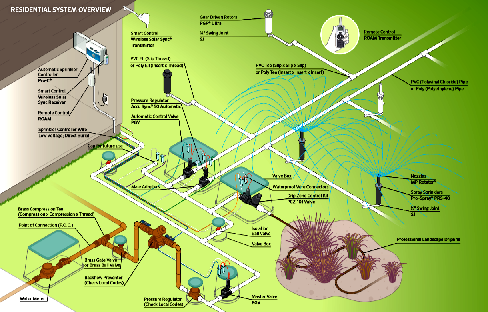
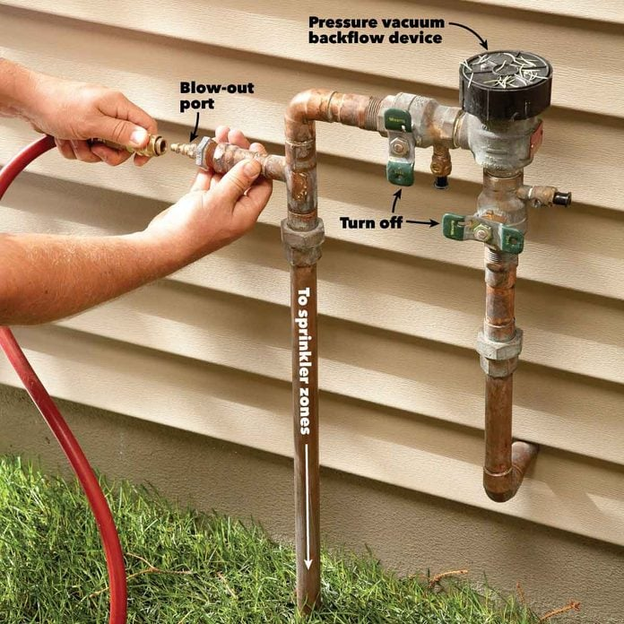
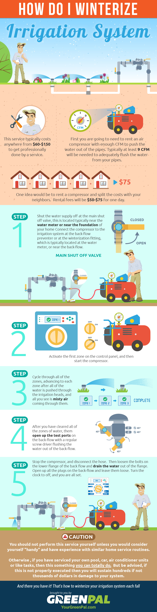

# Irrigation Installation

## 1. Planning & Design

### 1.1 Survey Your Yard
- Measure lawn, garden beds, trees, slopes, and obstacles.
- Determine water supply (main size, flow rate, and pressure).
- Check local codes for backflow prevention and permits.
- Group plants by water needs (hydrozoning).

### 1.2 Choose Irrigation Method
- **Lawn:** Pop-up spray or rotor heads.
- **Beds/Trees:** Drip or micro-irrigation.
- Match method to soil type (sandy = faster drainage, clay = slower).

### 1.3 Map Zone Layout
- Sketch your yard and mark zones, valves, heads, and lines.
- Avoid overloading zones (respect flow and pressure limits).
- Use appropriate nozzle and head spacing.

---

## 2. Materials & Tools

### Materials
- PVC or polyethylene (PE) pipe for main/lateral lines.
- Valve manifold and zone valves.
- Sprinkler heads (spray, rotor, drip, bubbler).
- Controller/timer (preferably smart or weather-based).
- Backflow preventer, filters, and regulators.
- Fittings, connectors, primer/cement, wiring, and valve boxes.

### Tools
- Trenching shovel or trencher.
- Pipe cutters, PVC tools.
- Wire strippers, crimpers.
- Pressure gauge and measuring tape.
- Flags or paint for layout.

---

## 3. Installation Steps

1. **Mark Layout:** Outline trenches, heads, and valves.
2. **Shut Off Water:** Install backflow preventer.
3. **Main Line:** Run supply to valve manifold.
4. **Valves:** Install and label by zone.
5. **Lateral Lines:** Dig 6–12” trenches and install piping.
6. **Sprinkler Heads/Drip Lines:** Place for uniform coverage.
7. **Controller Wiring:** Connect zones to timer and power.
8. **Backfill:** After leak and flow tests.
9. **Testing:** Flush lines, check coverage, adjust heads.

---

## 4. Best Practices & Water Efficiency

- Use **smart controllers** or rain sensors.
- Water early morning to minimize evaporation.
- Water deeply and less often for healthy roots.
- Hydrozone (group similar plants together).
- Avoid overspray on pavement.
- Use pressure regulators and check valves.
- Maintain and winterize system annually.

### Water-Saving Tips
- Prefer drip/micro-irrigation for non-turf areas.
- Install soil moisture or rain sensors.
- Use matched precipitation nozzles.
- Regularly check for leaks or clogged emitters.

---

## 5. Maintenance & Long-Term Care

### Seasonal Tasks
- **Spring:** Flush lines, test zones, adjust heads.
- **Summer:** Check alignment, clean filters.
- **Fall:** Reduce watering frequency.
- **Winter:** Drain system, protect valves and backflow preventer.

### Common Issues
- Overspray and uneven coverage.
- Mixing head types in zones.
- Shallow trenches → pipe damage.
- Ignoring flow/pressure limits.
- Fixed schedules without weather adjustment.

---

## 6. Utah-Specific Tips

- Protect valves/backflow from freezing.
- Follow city watering restrictions (odd/even days, early hours).
- Favor drought-tolerant plants.
- Test infiltration (many Utah soils are sandy or rocky).
- Use a weather-based controller to optimize water use.

---

## 7. References & Resources

- [RainBird Design Tips](https://www.rainbird.com/agency/irrigation-design-tips-locating-sprinklers-plan)
- [Utah State University Extension – Irrigation Guides](https://extension.usu.edu/yardandgarden/)
- [EPA WaterSense – Outdoor Watering Efficiency](https://www.epa.gov/watersense/outdoor)
- [Irrigate Smart – Maintenance Tips](https://irrigatesmart.com/best-practices-irrigation-maintenance/)

---